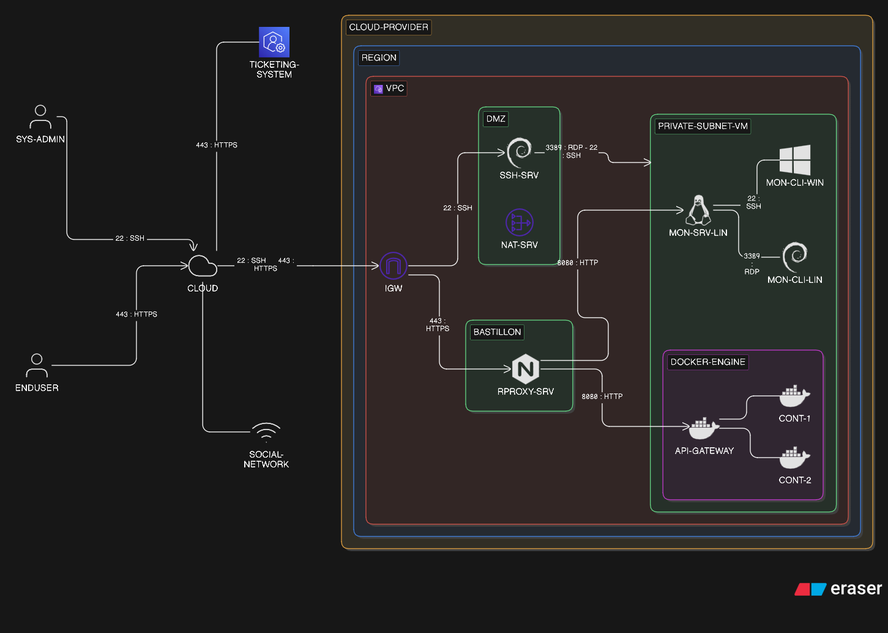

# Vision du projet

Ce projet vise à concevoir et démontrer une solution de monitoring applicatif capable d’assurer une supervision fiable, proactive et compréhensible d’une infrastructure informatique hétérogène hébergée dans le cloud.

Dans un contexte où la disponibilité et la performance des services sont critiques, la solution devra permettre d’anticiper les incidents, de réagir rapidement aux défaillances et de fournir une visibilité adaptée à différents types d’utilisateurs, des équipes techniques aux utilisateurs finaux.

En adoptant une approche agile, le projet s’inscrit dans une logique d’amélioration continue, où la solution évolue progressivement pour répondre aux besoins opérationnels et aux contraintes de l’infrastructure cible.

## Fonctionnalité clés de la solution

La solution développée devra :

* Fournir une vision globale et en temps réel de l’état de santé de l’infrastructure
* Détecter automatiquement les comportements anormaux (charge, consommation, indisponibilité)
* Déclencher des actions correctives en cas d’incident (redémarrage de services, ajustement de configuration)
*Adapter la communication selon les publics :
  * technique (diagnostic et intervention)
  * non technique (information claire en cas d’incident)
 
## Contexte technique

L’infrastructure à superviser présente les caractéristiques suivantes :

* Hébergement sur un fournisseur cloud dans une région définie
* Environnement hétérogène (Windows, Linux, conteneurs)
* Contraintes de sécurité et d’architecture (DMZ, bastion, réseau, FQDN)

## Cadre du projet

Le projet s’inscrit dans un cadre partiellement contraint :

Éléments imposés :

* Systèmes clients à superviser
* Architecture réseau et sécurité
* Certaines fonctionnalités attendues
* Priorisation du backlog
* Outils et pratiques collaboratives (principe agile)

Éléments ouverts :

* Choix des technologies de monitoring
* Choix du système du serveur de supervision
* Organisation de l’équipe
* Méthodologie de travail (sprints, rituels)

## Schéma

